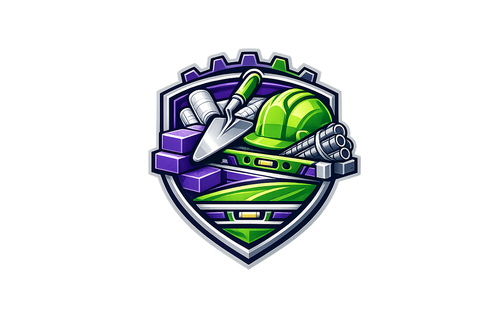

# 🏗️ Fixopolis Frontend

<p align="center">
  
</p>

## 📌 Descripción

**Fixopolis Frontend** es una aplicación web desarrollada en React que simula una tienda de ferretería enfocada en el sector construcción.  
Permite la visualización y gestión de materiales, autenticación de usuarios, administración de productos y simulación de compras, consumiendo una API backend desarrollada en .NET.

Este proyecto forma parte del ecosistema **Fixopolis**, orientado a ofrecer soluciones digitales para el sector ferretero y de gestión de proyectos de construcción.

---

## 🧠 Arquitectura

El proyecto está construido bajo una arquitectura modular, separando responsabilidades por dominio funcional:

- `Auth` → Autenticación y manejo de sesiones
- `Shop` → Catálogo, productos y navegación pública
- `Admin` → Gestión interna de productos, ordenes y administración
- `Customer` → Experiencia del cliente (órdenes, compras, carrito, perfil)

Esto permite:

- Escalabilidad estructural
- Separación clara de responsabilidades
- Mantenimiento más sencillo
- Posible migración futura a microfrontends

---

## 🛠️ Stack Tecnológico

| Tecnología       | Propósito                |
| ---------------- | ------------------------ |
| React            | Librería principal de UI |
| React Router     | Enrutamiento SPA         |
| Zustand          | Manejo global de estado  |
| TailwindCSS      | Estilos utilitarios      |
| .NET API         | Backend                  |
| PostgreSQL       | Base de datos            |
| Entity Framework | ORM del backend          |

Backend relacionado:  
👉 https://github.com/JoseEsmil04/fixopolis-api

---

<h2>📂 Estructura del Proyecto</h2>

<div align="center">
  <div style="max-width: 820px; text-align: left;">
    <pre>
src/
├── auth/          # Módulo de autenticación
├── shop/          # Catálogo y navegación pública
├── admin/         # Panel administrativo
├── customer/      # Funcionalidades del cliente
│
├── components/    # Componentes reutilizables
├── store/         # Zustand global store
├── app.routes/    # Configuración de rutas
├── assets/        # Logo e imágenes
└── lib/utils/     # Helpers y funciones compartidas
    </pre>
  </div>
</div>

---

## ⚙️ Instalación

### 1️⃣ Clonar repositorio

```bash
git clone https://github.com/JoseEsmil04/fixopolis-frontend.git
cd fixopolis-frontend
```

### 2️⃣ Instalar dependencias

```bash
npm install
```

### 3️⃣ Ejecutar en desarrollo

```bash
npm run dev
```

## La aplicación correrá en:

http://localhost:5173

## 🔐 Variables de Entorno

Crear un archivo .env en la raíz:

```
VITE_API_URL=http://localhost:5000/api
```

---

## 🚀 Deployment

El proyecto puede desplegarse en:

- Vercel
- Netlify
- Render
- Docker (opcional)

## 🔨 Build de Producción

```bash
npm run build
```

### Se generará la carpeta:

dist/

---

## 🔗 Integración Backend

Este frontend consume el proyecto backend:

### Fixopolis API

- .NET 9

- PostgreSQL

- Entity Framework Core

- Clean Architecture

### ⚠️ Asegúrate de configurar correctamente la URL del backend en las variables de entorno (.env).

Ejemplo:

```
VITE_API_URL=http://localhost:5000/api
```

## 👨‍💻 Autor

### Jose Esmi Campusano

### GitHub:

https://github.com/JoseEsmil04
